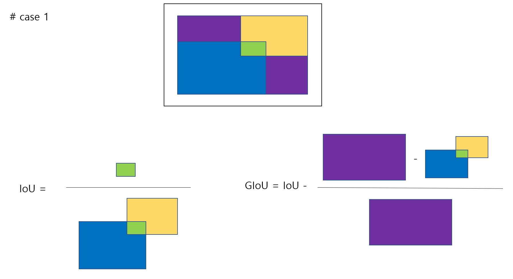
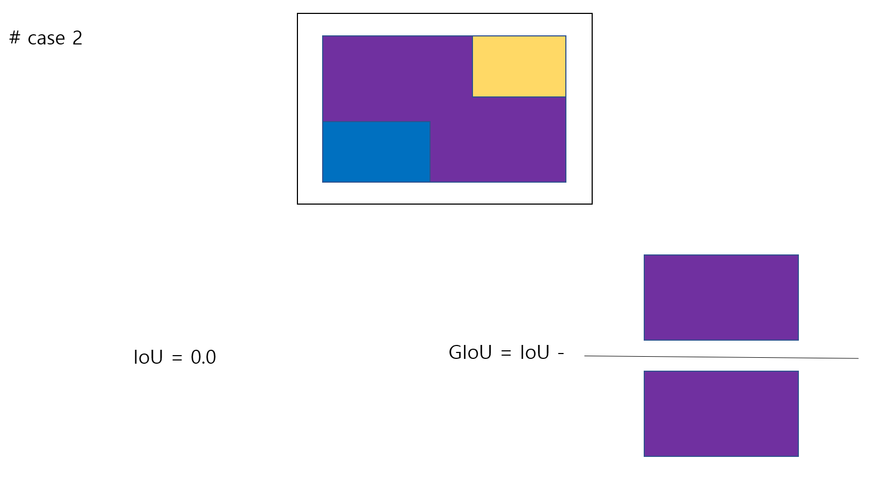

# Generalized Intersection Over Union: A Metric and a Loss for Bounding Box Regression

## # Summary
1. It is good to learn by evaluation metrics (ex. IOU)
2. IOU Loss gives only error between 0 and 1. However, using GIoU can give errors from 0 to 2.
3. Results are better with the YOLO structure than with the RCNN structure.

## # Hand-drawn picture example XD



## # Code

```python
'''
# Copyright (C) 2019 * Ltd. All rights reserved.
# author : SangHyeon Jo <josanghyeokn@gmail.com>

GIoU = IoU - (C - (A U B))/C
GIoU_Loss = 1 - GIoU
'''
def GIoU(bboxes_1, bboxes_2):
    # 1. calulate intersection over union
    area_1 = (bboxes_1[..., 2] - bboxes_1[..., 0]) * (bboxes_1[..., 3] - bboxes_1[..., 1])
    area_2 = (bboxes_2[..., 2] - bboxes_2[..., 0]) * (bboxes_2[..., 3] - bboxes_2[..., 1])
    
    intersection_wh = tf.minimum(bboxes_1[:, :, 2:], bboxes_2[:, :, 2:]) - tf.maximum(bboxes_1[:, :, :2], bboxes_2[:, :, :2])
    intersection_wh = tf.maximum(intersection_wh, 0)
    
    intersection = intersection_wh[..., 0] * intersection_wh[..., 1]
    union = (area_1 + area_2) - intersection
    
    ious = intersection / tf.maximum(union, 1e-10)
    
    # 2. (C - (A U B))/C
    C_wh = tf.maximum(bboxes_1[..., 2:], bboxes_2[..., 2:]) - tf.minimum(bboxes_1[..., :2], bboxes_2[..., :2])
    C_wh = tf.maximum(C_wh, 0.0)
    C = C_wh[..., 0] * C_wh[..., 1]

    giou = ious - (C - union) / tf.maximum(C, 1e-10)
    return giou
```

## # Reference
- Generalized Intersection Over Union: A Metric and a Loss for Bounding Box Regression (http://openaccess.thecvf.com/content_CVPR_2019/papers/Rezatofighi_Generalized_Intersection_Over_Union_A_Metric_and_a_Loss_for_CVPR_2019_paper.pdf)